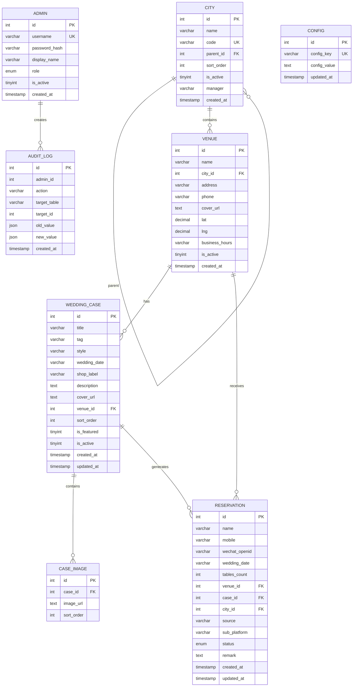

# 0223wechat 数据库设计文档

> 版本: 2.0
> 更新日期: 2025-02-25
> 数据库: MySQL 8.0+ / wedding_cms

---

## 一、ER 图 (Entity-Relationship Diagram)



---

## 二、表结构详细设计

### 2.1 city (城市/区域) ⭐聚合根

| 字段 | 类型 | 约束 | 默认值 | 说明 |
|------|------|------|--------|------|
| id | INT | PK, AUTO_INCREMENT | - | 主键 |
| name | VARCHAR(20) | NOT NULL, UNIQUE | - | 城市名称 |
| region | VARCHAR(20) | - | '' | 区域 (华东/华北/华南) |
| sort_order | INT | - | 0 | 排序权重 |
| is_active | TINYINT(1) | - | 1 | 是否启用 |
| created_at | TIMESTAMP | - | CURRENT_TIMESTAMP | 创建时间 |

**索引**:
- `name` (UNIQUE)
- `idx_active_sort (is_active, sort_order)` - 列表查询

**作为聚合根的意义**:
- 所有数据维度的顶层实体
- 门店通过 `city_id` 关联
- 支持区域级别的统计和配置
- 可扩展支持多层级（未来：区域 → 城市）

---

### 2.2 admin (管理员)

| 字段 | 类型 | 约束 | 默认值 | 说明 |
|------|------|------|--------|------|
| id | INT | PK, AUTO_INCREMENT | - | 主键 |
| username | VARCHAR(50) | NOT NULL, UNIQUE | - | 登录用户名 |
| password_hash | VARCHAR(255) | NOT NULL | - | 密码 (待迁移bcrypt) |
| display_name | VARCHAR(50) | - | '' | 显示名称 |
| role | ENUM | - | 'editor' | 角色: super/editor/viewer |
| is_active | TINYINT(1) | - | 1 | 是否启用 |
| created_at | TIMESTAMP | - | CURRENT_TIMESTAMP | 创建时间 |

**索引**:
- `username` (UNIQUE)

**问题**:
- ⚠️ password_hash 当前存储明文，需迁移到 bcrypt
- ⚠️ 缺少 updated_at 字段

---

### 2.2 config (全局配置)

| 字段 | 类型 | 约束 | 默认值 | 说明 |
|------|------|------|--------|------|
| id | INT | PK, AUTO_INCREMENT | - | 主键 |
| config_key | VARCHAR(100) | NOT NULL, UNIQUE | - | 配置键 |
| config_value | TEXT | - | NULL | 配置值 |
| updated_at | TIMESTAMP | - | ON UPDATE CURRENT_TIMESTAMP | 更新时间 |

**索引**:
- `config_key` (UNIQUE)

---

### 2.3 venue (门店场地)

| 字段 | 类型 | 约束 | 默认值 | 说明 |
|------|------|------|--------|------|
| id | INT | PK, AUTO_INCREMENT | - | 主键 |
| name | VARCHAR(100) | NOT NULL | - | 门店名称 |
| city | VARCHAR(20) | NOT NULL | '' | 所属城市 |
| address | VARCHAR(255) | - | '' | 详细地址 |
| phone | VARCHAR(50) | - | '' | 联系电话 |
| cover_url | TEXT | - | NULL | 门店封面图 |
| lat | DECIMAL(10,7) | - | NULL | 纬度 |
| lng | DECIMAL(10,7) | - | NULL | 经度 |
| business_hours | VARCHAR(100) | - | '' | 营业时间 |
| is_active | TINYINT(1) | - | 1 | 是否启用 |
| created_at | TIMESTAMP | - | CURRENT_TIMESTAMP | 创建时间 |

**索引**:
- `idx_city_active (city, is_active)` - 按城市筛选

**建议**:
- ⚠️ 添加 `UNIQUE (name, city)` 防止重复

---

### 2.4 wedding_case (婚礼主题/案例) ⭐核心表

| 字段 | 类型 | 约束 | 默认值 | 说明 |
|------|------|------|--------|------|
| id | INT | PK, AUTO_INCREMENT | - | 主键 |
| title | VARCHAR(100) | NOT NULL | - | 主题名称 |
| tag | VARCHAR(50) | - | '' | 价格标签 |
| style | VARCHAR(50) | - | '' | 风格/店铺标识 |
| wedding_date | VARCHAR(50) | - | '' | 婚礼日期 |
| shop_label | VARCHAR(50) | - | '' | 原始城市标识 |
| description | TEXT | - | NULL | 详细描述 |
| cover_url | TEXT | - | NULL | 封面图URL |
| venue_id | INT | FK | NULL | 所属门店 |
| sort_order | INT | - | 0 | 排序权重 |
| is_featured | TINYINT(1) | - | 0 | 首页推荐 |
| is_active | TINYINT(1) | - | 1 | 是否上线 |
| created_at | TIMESTAMP | - | CURRENT_TIMESTAMP | 创建时间 |
| updated_at | TIMESTAMP | - | ON UPDATE CURRENT_TIMESTAMP | 更新时间 |

**索引**:
- `idx_venue_active (venue_id, is_active)` - 按门店查主题
- `idx_featured (is_featured, is_active)` - 首页推荐
- `idx_sort_id (sort_order, id)` - 排序分页
- `idx_title (title(50))` - 搜索 (前缀索引)

**外键**:
- `fk_venue (venue_id) → venue(id) ON DELETE SET NULL`

**建议**:
- ❌ 添加 `UNIQUE (title, venue_id)` 防止重复主题
- ⚠️ style 字段语义漂移 (实际存店铺标识)
- ⚠️ shop_label 字段语义漂移 (实际存城市名)

---

### 2.5 case_image (主题详情图集)

| 字段 | 类型 | 约束 | 默认值 | 说明 |
|------|------|------|--------|------|
| id | INT | PK, AUTO_INCREMENT | - | 主键 |
| case_id | INT | NOT NULL, FK | - | 所属主题ID |
| image_url | TEXT | NOT NULL | - | 图片地址 |
| sort_order | INT | - | 0 | 排序 |

**索引**:
- `idx_case_sort (case_id, sort_order)` - 图片列表查询

**外键**:
- `(case_id) → wedding_case(id) ON DELETE CASCADE`

**建议**:
- ⚠️ 添加 `UNIQUE (case_id, image_url(255))` 防止重复图片
- ⚠️ image_url 改为 VARCHAR(500) 以支持索引

---

### 2.6 reservation (客资预约 CRM)

| 字段 | 类型 | 约束 | 默认值 | 说明 |
|------|------|------|--------|------|
| id | INT | PK, AUTO_INCREMENT | - | 主键 |
| name | VARCHAR(50) | NOT NULL | - | 客户姓名 |
| mobile | VARCHAR(20) | NOT NULL | - | 手机号 |
| wechat_openid | VARCHAR(64) | - | NULL | 微信OpenID |
| wedding_date | VARCHAR(50) | - | '' | 婚期 |
| tables_count | INT | - | 0 | 桌数 |
| venue_id | INT | FK | NULL | 意向门店 |
| case_id | INT | FK | NULL | 来源主题 |
| source | VARCHAR(50) | - | '小程序' | 来源渠道 |
| sub_platform | VARCHAR(50) | - | '' | 子平台标识 |
| city | VARCHAR(20) | - | '' | 意向城市 |
| status | ENUM | - | '待跟进' | 跟进状态 |
| remark | TEXT | - | NULL | 跟进备注 |
| created_at | TIMESTAMP | - | CURRENT_TIMESTAMP | 创建时间 |
| updated_at | TIMESTAMP | - | ON UPDATE CURRENT_TIMESTAMP | 更新时间 |

**状态枚举**:
- `待跟进` / `已联系` / `已签约` / `无效`

**索引**:
- `idx_mobile (mobile)` - 手机号查询
- `idx_status_created (status, created_at DESC)` - 状态+时间筛选
- `idx_created (created_at DESC)` - 时间排序
- `idx_city_status (city, status)` - 城市+状态筛选
- `idx_openid (wechat_openid)` - OpenID 查询

**外键**:
- `fk_res_venue (venue_id) → venue(id) ON DELETE SET NULL`
- `fk_res_case (case_id) → wedding_case(id) ON DELETE SET NULL`

---

### 2.7 audit_log (操作审计日志)

| 字段 | 类型 | 约束 | 默认值 | 说明 |
|------|------|------|--------|------|
| id | INT | PK, AUTO_INCREMENT | - | 主键 |
| admin_id | INT | - | NULL | 操作人 |
| action | VARCHAR(20) | NOT NULL | - | CREATE/UPDATE/DELETE |
| target_table | VARCHAR(50) | NOT NULL | - | 目标表 |
| target_id | INT | - | NULL | 目标行ID |
| old_value | JSON | - | NULL | 变更前快照 |
| new_value | JSON | - | NULL | 变更后快照 |
| created_at | TIMESTAMP | - | CURRENT_TIMESTAMP | 操作时间 |

**索引**:
- `idx_admin_time (admin_id, created_at)` - 按操作人查
- `idx_target (target_table, target_id)` - 按目标查

**建议**:
- ⚠️ admin_id 无外键约束 (设计选择：审计不因删除阻塞)
- ⚠️ 可选添加 ip_address 字段

---

## 三、外键关系总览

```
┌─────────────┐
│   admin     │
│  (管理员)   │
└─────────────┘
       │
       │ admin_id (无 FK，软关联)
       ▼
┌─────────────┐
│ audit_log   │
│ (审计日志)  │
└─────────────┘

┌─────────────┐     ┌─────────────┐     ┌─────────────┐
│   venue     │◄────│wedding_case │────►│case_image   │
│   (门店)    │ 1:N │  (主题)     │ 1:N │  (图片)     │
│             │     │             │     │ CASCADE     │
└──────┬──────┘     └──────┬──────┘     └─────────────┘
       │ SET NULL          │ SET NULL
       ▼                   ▼
┌─────────────────────────────────────────────────────┐
│                   reservation (客资预约)            │
└─────────────────────────────────────────────────────┘
```

**级联策略**:
| 主表 | 从表 | ON DELETE |
|------|------|----------|
| venue | wedding_case | SET NULL |
| venue | reservation | SET NULL |
| wedding_case | case_image | CASCADE |
| wedding_case | reservation | SET NULL |

---

## 四、索引策略

### 4.1 查询场景覆盖

| 查询场景 | 表 | 索引 | 覆盖情况 |
|----------|------|------|----------|
| 按门店查主题 | wedding_case | `idx_venue_active(venue_id, is_active)` | ✅ |
| 推荐主题 | wedding_case | `idx_featured(is_featured, is_active)` | ✅ |
| 排序分页 | wedding_case | `idx_sort_id(sort_order, id)` | ✅ |
| 搜索主题 | wedding_case | `idx_title(title(50))` | ⚠️ 前缀%无法用索引 |
| 图片列表 | case_image | `idx_case_sort(case_id, sort_order)` | ✅ |
| 预约状态筛选 | reservation | `idx_status_created(status, created_at)` | ✅ |
| 按城市筛选 | venue | `idx_city_active(city, is_active)` | ✅ |

### 4.2 索引设计原则

1. **最左前缀原则**: 复合索引按查询频率排列
2. **覆盖索引**: 高频查询尽量只用索引返回
3. **前缀索引**: TEXT/长字符串使用前缀索引
4. **避免冗余**: 不重复创建相同前缀的索引

---

## 五、DDL 脚本

### 5.1 建表脚本 (完整)

```sql
-- 1. admin
CREATE TABLE IF NOT EXISTS admin (
    id INT AUTO_INCREMENT PRIMARY KEY,
    username VARCHAR(50) NOT NULL UNIQUE COMMENT '登录用户名',
    password_hash VARCHAR(255) NOT NULL COMMENT '密码(待迁移bcrypt)',
    display_name VARCHAR(50) DEFAULT '' COMMENT '显示名称',
    role ENUM('super','editor','viewer') DEFAULT 'editor' COMMENT '角色',
    is_active TINYINT(1) DEFAULT 1 COMMENT '是否启用',
    created_at TIMESTAMP DEFAULT CURRENT_TIMESTAMP
) ENGINE=InnoDB DEFAULT CHARSET=utf8mb4 COMMENT='管理员';

-- 2. config
CREATE TABLE IF NOT EXISTS config (
    id INT AUTO_INCREMENT PRIMARY KEY,
    config_key VARCHAR(100) NOT NULL UNIQUE COMMENT '配置键',
    config_value TEXT COMMENT '配置值',
    updated_at TIMESTAMP DEFAULT CURRENT_TIMESTAMP ON UPDATE CURRENT_TIMESTAMP
) ENGINE=InnoDB DEFAULT CHARSET=utf8mb4 COMMENT='全局配置';

-- 3. venue
CREATE TABLE IF NOT EXISTS venue (
    id INT AUTO_INCREMENT PRIMARY KEY,
    name VARCHAR(100) NOT NULL COMMENT '门店名称',
    city VARCHAR(20) NOT NULL DEFAULT '' COMMENT '所属城市',
    address VARCHAR(255) DEFAULT '' COMMENT '详细地址',
    phone VARCHAR(50) DEFAULT '' COMMENT '联系电话',
    cover_url TEXT COMMENT '门店封面图',
    lat DECIMAL(10,7) DEFAULT NULL COMMENT '纬度',
    lng DECIMAL(10,7) DEFAULT NULL COMMENT '经度',
    business_hours VARCHAR(100) DEFAULT '' COMMENT '营业时间',
    is_active TINYINT(1) DEFAULT 1 COMMENT '是否启用',
    created_at TIMESTAMP DEFAULT CURRENT_TIMESTAMP,
    INDEX idx_city_active (city, is_active)
) ENGINE=InnoDB DEFAULT CHARSET=utf8mb4 COMMENT='门店场地';

-- 4. wedding_case
CREATE TABLE IF NOT EXISTS wedding_case (
    id INT AUTO_INCREMENT PRIMARY KEY,
    title VARCHAR(100) NOT NULL COMMENT '主题名称',
    tag VARCHAR(50) DEFAULT '' COMMENT '价格标签',
    style VARCHAR(50) DEFAULT '' COMMENT '风格标签',
    wedding_date VARCHAR(50) DEFAULT '' COMMENT '婚礼日期',
    shop_label VARCHAR(50) DEFAULT '' COMMENT '原始数据标识',
    description TEXT COMMENT '详细描述',
    cover_url TEXT COMMENT '封面图URL',
    venue_id INT DEFAULT NULL COMMENT '所属门店',
    sort_order INT DEFAULT 0 COMMENT '排序权重',
    is_featured TINYINT(1) DEFAULT 0 COMMENT '首页推荐',
    is_active TINYINT(1) DEFAULT 1 COMMENT '是否上线',
    created_at TIMESTAMP DEFAULT CURRENT_TIMESTAMP,
    updated_at TIMESTAMP DEFAULT CURRENT_TIMESTAMP ON UPDATE CURRENT_TIMESTAMP,
    INDEX idx_venue_active (venue_id, is_active),
    INDEX idx_featured (is_featured, is_active),
    INDEX idx_sort_id (sort_order, id),
    INDEX idx_title (title(50)),
    FOREIGN KEY fk_venue (venue_id) REFERENCES venue(id) ON DELETE SET NULL
) ENGINE=InnoDB DEFAULT CHARSET=utf8mb4 COMMENT='婚礼主题';

-- 5. case_image
CREATE TABLE IF NOT EXISTS case_image (
    id INT AUTO_INCREMENT PRIMARY KEY,
    case_id INT NOT NULL COMMENT '所属主题ID',
    image_url TEXT NOT NULL COMMENT '图片地址',
    sort_order INT DEFAULT 0 COMMENT '排序',
    INDEX idx_case_sort (case_id, sort_order),
    FOREIGN KEY (case_id) REFERENCES wedding_case(id) ON DELETE CASCADE
) ENGINE=InnoDB DEFAULT CHARSET=utf8mb4 COMMENT='主题图集';

-- 6. reservation
CREATE TABLE IF NOT EXISTS reservation (
    id INT AUTO_INCREMENT PRIMARY KEY,
    name VARCHAR(50) NOT NULL COMMENT '客户姓名',
    mobile VARCHAR(20) NOT NULL COMMENT '手机号',
    wechat_openid VARCHAR(64) DEFAULT NULL COMMENT '微信OpenID',
    wedding_date VARCHAR(50) DEFAULT '' COMMENT '婚期',
    tables_count INT DEFAULT 0 COMMENT '桌数',
    venue_id INT DEFAULT NULL COMMENT '意向门店',
    case_id INT DEFAULT NULL COMMENT '来源主题',
    source VARCHAR(50) DEFAULT '小程序' COMMENT '来源渠道',
    sub_platform VARCHAR(50) DEFAULT '' COMMENT '子平台标识',
    city VARCHAR(20) DEFAULT '' COMMENT '意向城市',
    status ENUM('待跟进','已联系','已签约','无效') DEFAULT '待跟进' COMMENT '跟进状态',
    remark TEXT COMMENT '跟进备注',
    created_at TIMESTAMP DEFAULT CURRENT_TIMESTAMP,
    updated_at TIMESTAMP DEFAULT CURRENT_TIMESTAMP ON UPDATE CURRENT_TIMESTAMP,
    INDEX idx_mobile (mobile),
    INDEX idx_status_created (status, created_at DESC),
    INDEX idx_created (created_at DESC),
    INDEX idx_city_status (city, status),
    INDEX idx_openid (wechat_openid),
    FOREIGN KEY fk_res_venue (venue_id) REFERENCES venue(id) ON DELETE SET NULL,
    FOREIGN KEY fk_res_case (case_id) REFERENCES wedding_case(id) ON DELETE SET NULL
) ENGINE=InnoDB DEFAULT CHARSET=utf8mb4 COMMENT='客资预约CRM';

-- 7. audit_log
CREATE TABLE IF NOT EXISTS audit_log (
    id INT AUTO_INCREMENT PRIMARY KEY,
    admin_id INT DEFAULT NULL COMMENT '操作人',
    action VARCHAR(20) NOT NULL COMMENT 'CREATE/UPDATE/DELETE',
    target_table VARCHAR(50) NOT NULL COMMENT '目标表',
    target_id INT DEFAULT NULL COMMENT '目标行ID',
    old_value JSON COMMENT '变更前快照',
    new_value JSON COMMENT '变更后快照',
    created_at TIMESTAMP DEFAULT CURRENT_TIMESTAMP,
    INDEX idx_admin_time (admin_id, created_at),
    INDEX idx_target (target_table, target_id)
) ENGINE=InnoDB DEFAULT CHARSET=utf8mb4 COMMENT='操作审计日志';
```

### 5.2 优化脚本 (待执行)

```sql
-- P1: 唯一约束 (防止重复数据)
ALTER TABLE wedding_case ADD UNIQUE INDEX uk_title_venue (title, venue_id);
ALTER TABLE case_image ADD UNIQUE INDEX uk_case_url (case_id, image_url(255));
ALTER TABLE venue ADD UNIQUE INDEX uk_name_city (name, city);

-- P2: 字段优化 (可选)
ALTER TABLE wedding_case MODIFY cover_url VARCHAR(500) DEFAULT '' COMMENT '封面图URL';
ALTER TABLE case_image MODIFY image_url VARCHAR(500) NOT NULL COMMENT '图片地址';
```

---

## 六、问题清单

| # | 级别 | 表 | 问题 | 建议修复 |
|---|------|------|------|----------|
| 1 | **P1** | wedding_case | 缺少 `(title, venue_id)` 唯一约束 | 添加 UNIQUE INDEX |
| 2 | **P1** | case_image | 缺少 `(case_id, image_url)` 唯一约束 | 添加 UNIQUE INDEX |
| 3 | **P1** | admin | password_hash 明文存储 | 迁移到 bcrypt |
| 4 | **P2** | venue | 缺少 `(name, city)` 唯一约束 | 添加 UNIQUE INDEX |
| 5 | **P2** | wedding_case | style 语义漂移 (实际存店铺标识) | 考虑重命名 |
| 6 | **P2** | wedding_case | shop_label 语义漂移 (实际存城市) | 考虑重命名 |
| 7 | **P2** | cover_url/image_url | TEXT 类型无法索引 | 改为 VARCHAR(500) |
| 8 | **P3** | audit_log | admin_id 无外键 | 设计选择，保留现状 |

---

## 七、数据流图

```
┌─────────────────────────────────────────────────────────────────┐
│                        数据来源                                  │
├─────────────────────────────────────────────────────────────────┤
│  1. shop.json (远程)          → seed_original_themes.cjs        │
│  2. CMS Admin 后台            → /api/admin/* 接口               │
│  3. 小程序预约                 → /api/booking 接口              │
└─────────────────────────────────────────────────────────────────┘
                              │
                              ▼
┌─────────────────────────────────────────────────────────────────┐
│                        MySQL 存储                                │
├─────────────────────────────────────────────────────────────────┤
│  venue          ← 门店基础数据                                   │
│  wedding_case   ← 主题数据 (关联 venue)                          │
│  case_image     ← 图片数据 (关联 wedding_case, CASCADE)          │
│  reservation    ← 预约数据 (关联 venue, wedding_case)            │
│  admin          ← 管理员                                         │
│  config         ← 全局配置                                       │
│  audit_log      ← 操作日志                                       │
└─────────────────────────────────────────────────────────────────┘
                              │
                              ▼
┌─────────────────────────────────────────────────────────────────┐
│                        数据消费                                  │
├─────────────────────────────────────────────────────────────────┤
│  小程序:                                                         │
│    GET /api/home        → venues + cases (首页)                 │
│    GET /api/venues      → 门店列表 (找场地)                      │
│    GET /api/cases/live  → 案例瀑布流 (婚礼现场)                  │
│    GET /api/cases/:id   → 案例详情 + 图片                        │
│                                                                  │
│  Admin 后台:                                                     │
│    CRUD /api/admin/venues       → 门店管理                       │
│    CRUD /api/admin/themes       → 主题管理                       │
│    READ /api/admin/reservations → 预约管理                       │
└─────────────────────────────────────────────────────────────────┘
```

---

## 八、审核清单 (Codex Review)

### 8.1 结构审核
- [ ] 主键设计合理性
- [ ] 外键关系正确性
- [ ] 索引覆盖完整性
- [ ] 字段类型选择
- [ ] 默认值设置
- [ ] NOT NULL 约束
- [ ] UNIQUE 约束

### 8.2 命名审核
- [ ] 表名规范 (snake_case)
- [ ] 字段名语义准确
- [ ] 索引名规范 (idx_/uk_/fk_)

### 8.3 性能审核
- [ ] 高频查询索引覆盖
- [ ] 避免 N+1 查询
- [ ] 大字段类型选择
- [ ] 分页查询效率

### 8.4 安全审核
- [ ] 敏感字段加密
- [ ] SQL 注入防护
- [ ] 级联删除风险
